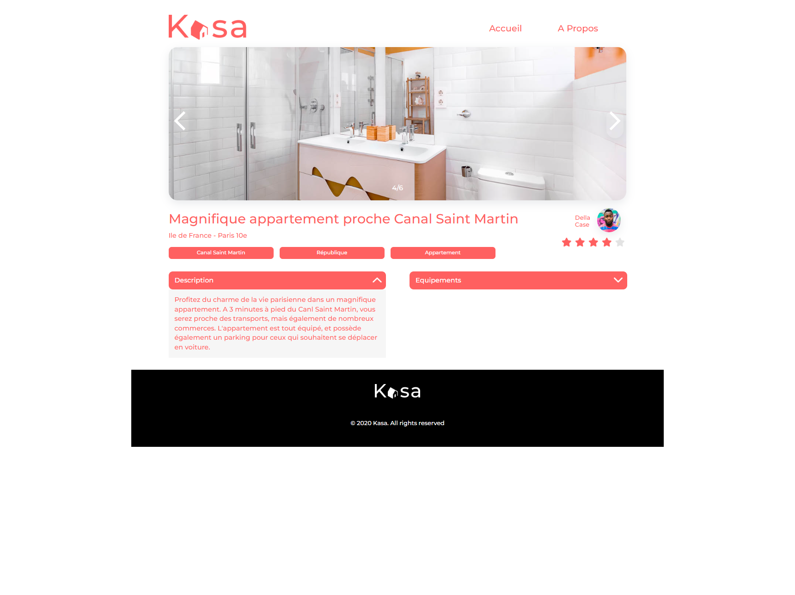
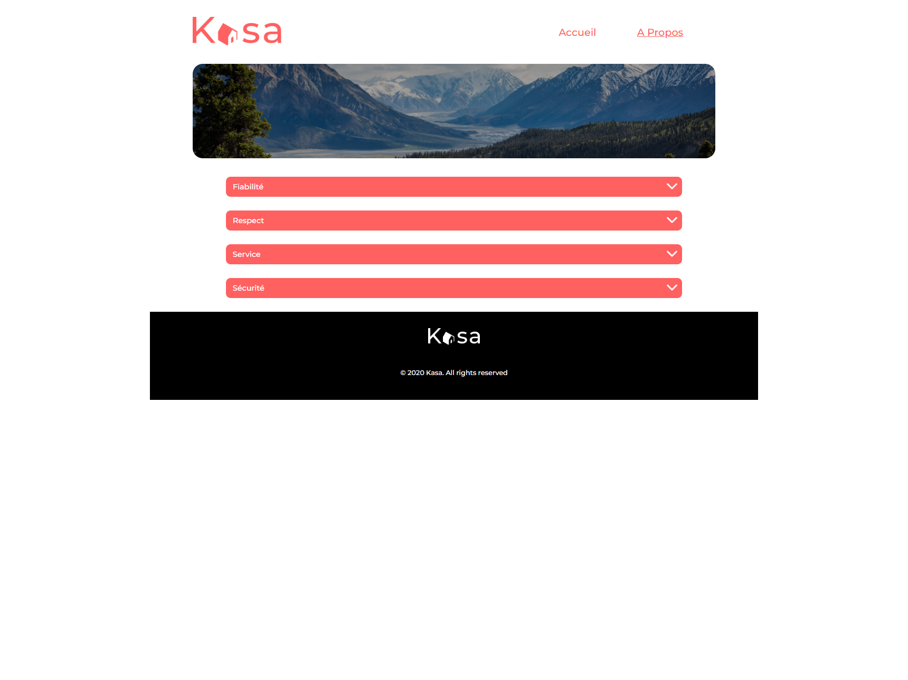
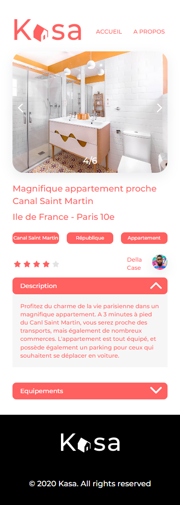
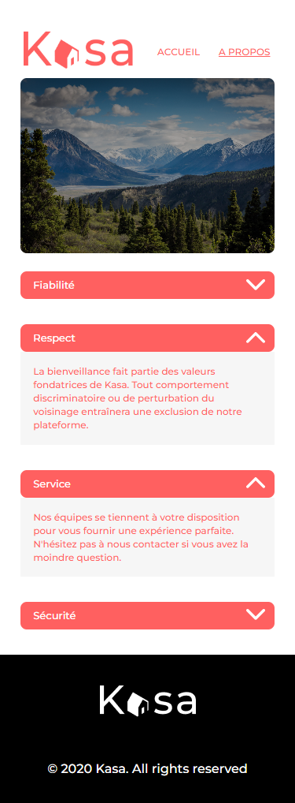

# React + Vite

# **MyDevWebLearning-P7-project: Kasa**

Septième et dernier projet du parcours "Développeur web" chez OpenClassroom. L'objectif de ce projet est de créer une application web de location immobilière avec React.
Vous trouverez [le brief complet du projet]
(https://openclassrooms.com/fr/paths/556/projects/677/assignment)ici.
 
Vous trouverez [les specifications fonctionnelles et techniques du projet](https://course.oc-static.com/projects/Front-End+V2/P9+React+1/Coding+guidelines+Kasa+FR.pdf) ici.

#

## <ins> Objectifs </ins>

1. Créer une application web de location immobilière avec React.
2. Configurer la navigation entre les pages de l'application avec React Router.
3. Initialiser une application React.
4. Développer des éléments de l'interface d'un site web grâce à des composants React

## <ins>Aperçu du projet</ins>  &nbsp;

  

  &nbsp;

  

  &nbsp;

  

  &nbsp;

  

  &nbsp;

  

  &nbsp;

  

  &nbsp;

## <ins> Livrables </ins>

-   Un fichier au format TXT ou PDF comprenant le lien vers mon code sur GitHub contenant l’ensemble du projet, à savoir :
    le code React de l’application ;
    le code React Router pour les routes dans un fichier dédié..
     

## <ins>Faire tourner le projet</ins>  &nbsp;

Vous aurez besoin d'avoir Node et `yarn` installés localement sur votre machine.
Clonez ce dépôt. , exécutez `yarn install`. Vous pourrez alors demarrer le serveur avec `yarn run dev`.
Le serveur doit fonctionner sur `localhost`.

This template provides a minimal setup to get React working in Vite with HMR and some ESLint rules.
Currently, two official plugins are available:

-   [@vitejs/plugin-react](https://github.com/vitejs/vite-plugin-react/blob/main/packages/plugin-react/README.md) uses [Babel](https://babeljs.io/) for Fast Refresh
-   [@vitejs/plugin-react-swc](https://github.com/vitejs/vite-plugin-react-swc) uses [SWC](https://swc.rs/) for Fast Refresh

This template provides a minimal setup to get React working in Vite with HMR and some ESLint rules.

Currently, two official plugins are available:

-   [@vitejs/plugin-react](https://github.com/vitejs/vite-plugin-react/blob/main/packages/plugin-react/README.md) uses [Babel](https://babeljs.io/) for Fast Refresh
-   [@vitejs/plugin-react-swc](https://github.com/vitejs/vite-plugin-react-swc) uses [SWC](https://swc.rs/) for Fast Refresh
